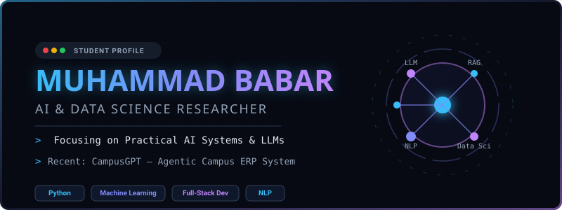

# Muhammad Babar 👋

  

  <strong>Data Science Graduate | AI/ML &amp; Backend Developer | AI Agents &amp; LLM Systems | Python • Django • FastAPI • Rust • Zig</strong>

  
  
  

---

I am a Data Science graduate with a strong Computer Science foundation and hands-on experience in AI/ML, backend development, data analytics, and AI-powered systems.

My work focuses on building practical intelligent applications, AI agents, LLM-based workflows, backend APIs, database systems, and scalable software solutions. I am also interested in systems programming with Rust and Zig, especially for performance-focused and reliable software development.

## 🚀 Current Focus

- AI agents and LLM-based applications
- Backend development with Django and FastAPI
- Machine learning and data science projects
- Database systems and REST APIs
- Systems programming with Rust and Zig
- Research interest: machine unlearning in Large Language Models, responsible AI, and AI governance

---

## 🛠️ Tech Stack

| Category | Technologies |
| :--- | :--- |
| **Programming Languages** |        |
| **Backend & Databases** |      |
| **AI / ML & Data Science** |       Deep Learning • NLP • RAG • LLM APIs • AI Agents • Data Visualization |
| **Frontend & Tools** |          |

---

## 📌 Featured Projects

### [CampusGPT — AI-Powered Campus ERP System](https://github.com/babar-xagi/CampusGpt)
AI-powered academic ERP system featuring NLP-based academic assistance, CGPA/SGPA prediction, attendance-risk analysis, automated quiz and assignment generation, and role-based dashboards.
* *Tech Stack: Python, Machine Learning, NLP, Gemini/Groq APIs, Fullstack Web*

### [AI Database Agent](https://github.com/babar-xagi/AI-Database-Agent)
LLM-based database agent that enables users to interact with structured records using natural language commands for automatic CRUD operations.
* *Tech Stack: Python, LangChain, Gemini/Groq APIs, PostgreSQL/MySQL*

### [ShopHub](https://github.com/babar-xagi/ShopHub)
Multi-vendor e-commerce platform designed to support small sellers and create digital earning opportunities (aligned with UN SDG 17).
* *Tech Stack: PHP, JavaScript, CSS, MySQL*

### [Tech Stock Performance Analysis Dashboard](https://github.com/babar-xagi/Tech-Stock-Performance-Analysis-Dashboard)
Data science dashboard for analyzing technology stock performance using visualization, trend analysis, and prediction-oriented workflows.
* *Tech Stack: Python, Pandas, Matplotlib, Scikit-learn*

### [Global Travel Search Plugin](https://github.com/babar-xagi/Travel-Plugin)
Custom WordPress travel search plugin for hotel, car, and flight search workflows using PHP, AJAX, JavaScript, and third-party APIs.
* *Tech: PHP, AJAX, JS, WordPress, Third-party Travel APIs*

---

## 🎓 Education

* **BS Data Science** — The Superior University, Lahore
  * 2024 – 2026 | CGPA: 3.28 / 4.00
* **Associate Degree in Computer Science** — The Superior University, Lahore
  * 2021 – 2023 | CGPA: 3.67 / 4.00

---

## 🏅 Selected Certifications

- **Machine Learning Specialization** — DeepLearning.AI
- **Google Advanced Data Analytics Professional Certificate** — Google
- **Python for Everybody Specialization** — University of Michigan
- **Databases and SQL for Data Science with Python** — IBM
- **Data Engineering with Rust** — Duke University

---

## 📊 GitHub Analytics

  
  

  

---

## 📫 Connect With Me

* **LinkedIn:** [linkedin.com/in/m-babar-agi/](https://www.linkedin.com/in/m-babar-agi/)
* **Portfolio:** [babar-xagi.github.io](https://babar-xagi.github.io/)
* **Email:** [babar.xagi@gmail.com](mailto:babar.xagi@gmail.com)
